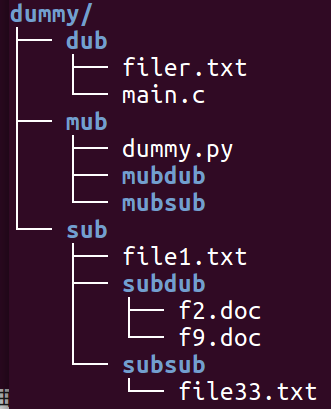

# Commmand line tutoiral - Session 02: File System
## File system navigation and manipulation

## Topics covered
1. Files and Directories.
	- File: name, content, place to keep, admin data.
	- Directory:
	- File system hierarchy.
2. Paths.
	- Absolute path.
	- Relative path.
	- Home.
	- Current directory/Working directory.
3. Commands:
	- pwd
	- cd
	- ls
	- mkdir
	- touch
	- cp
	- mv
	- rm
	
4. Exercises
	- list all the files in the current directory
	- list all the files in /usr/bin
	- list the files
	- move to your home directory and create a directory called dummy.
		inside dummy create a structure like this:  
	

	- go to directory subdub. use absolute paths.
	- without moving from subdub, copy the file f2.doc from subdub to sub. use absolute paths.
	- without moving from subdub, copy the file f2.doc from subdub to sub. use relative paths.
	- without moving from subdub, copy the file dummy.py from mub to subsub. use absolute paths.
	- without moving from subdub, copy the file dummy.py from mub to subsub. use relative paths.
	- go to the folder dub. move the file filter.txt to dummy.
